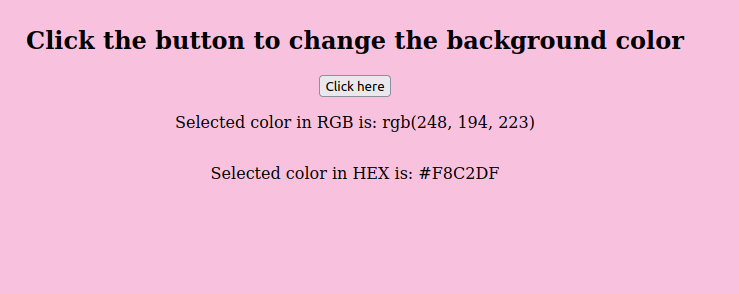

# Color Picker using HTML, CSS, and JavaScript

A simple and interactive color picker application built with HTML, CSS, and JavaScript. This tool allows users to generate a random background color, view its RGB and hexadecimal values, and see the color applied in real-time. This project is perfect for web developers and designers who want to experiment with color schemes or learn more about color conversions.

## Features

- **Random Color Generation:** Generate a random background color with a single click.
- **RGB and Hex Display:** View the generated color's RGB and hexadecimal values.
- **Real-Time Background Update:** See the generated color applied to the background instantly.

## Getting Started

Follow these instructions to run the application locally.

### Prerequisites

To run this project, you will need:

- A modern web browser (Chrome, Firefox, Safari, Edge, etc.)
- A text editor (optional, if you want to edit the code) like [Visual Studio Code](https://code.visualstudio.com/), [Sublime Text](https://www.sublimetext.com/), or any other editor of your choice.

### Installation

1. **Clone the Repository:**

   ```bash
   git clone https://github.com/yourusername/color-picker.git
   ```
2. **Navigate to the Project Directory:**
   ```bash
   cd color-picker
   ```
3. Open the `index.html` File:
4. You can open the index.html file directly in your web browser. There is no need for any server setup or additional configuration.

    Double-click the index.html file to open it in your default web browser.
    
    Alternatively, you can right-click on the index.html file and select "Open with" to choose a specific browser.

### Usage
- Click the "Generate Color" Button:

- Click the button to generate a random background color. The color will be     applied to the entire page.
- View RGB and Hex Values.
- The RGB and hexadecimal values of the generated color will be displayed on the screen.

### Example
Here's how the application looks:



### Contributing
If you'd like to contribute to this project, feel free to fork the repository and submit a pull request. Contributions, whether they're bug fixes, feature additions, or improvements to the documentation, are always welcome!

### License
This project is licensed under the MIT License.

### Contact
For any questions or suggestions, feel free to reach out to me via GitHub issues or at devconnects@gmail.com.
